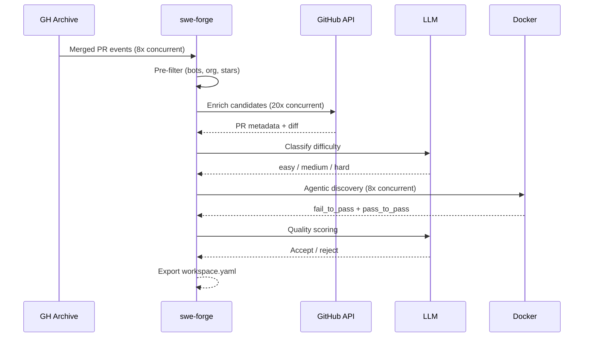
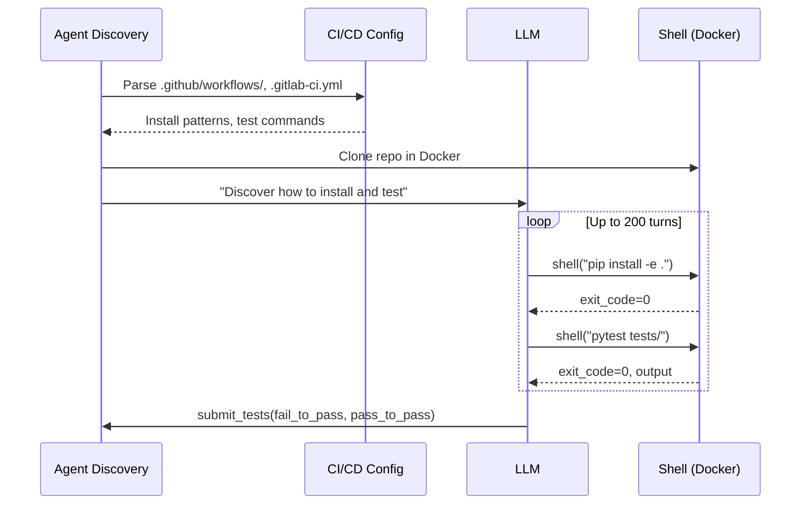

<h1 align="center">SWE-Forge (Python)</h1>

<p align="center">
  <a href="https://www.python.org/"></a>
  <a href="LICENSE"></a>
  <a href="https://huggingface.co/datasets/CortexLM/swe-forge"></a>
</p>

**High-performance SWE-bench dataset generator and evaluation harness that mines real GitHub pull requests, produces evaluation-ready task instances, and benchmarks coding agents.**

Built on top of [SweInfinite](https://github.com/unconst/SweInfinite) by [@unconst](https://github.com/unconst), rewritten in Python with:
- Agentic command discovery (NO hardcoded install commands)
- Language detection (rule-based, OK to hardcode)
- Difficulty filtering with LLM classification
- Docker verification of generated tests
- Full parallelism with semaphore-based concurrency
- Structured LLM outputs via OpenAI function calling
- 200k context auto-compaction with smart summarization

---

## What it does

swe-forge connects to [GH Archive](https://www.gharchive.org/) to discover recently merged pull requests, enriches them via the GitHub API, classifies their difficulty using an LLM, discovers install/test commands agenticly, generates test specifications via an agentic loop, and exports SWE-bench-compatible task instances.

## Key Features

| Feature | Description |
|---------|-------------|
| 🔍 **Real GitHub Data** | Mines GH Archive for merged PRs across all public repositories |
| 🎯 **Difficulty Filtering** | Pre-classifies PRs as easy/medium/hard before expensive processing |
| 🤖 **Agentic Discovery** | Discovers install/test commands from CI/CD (NO hardcoding) |
| 📦 **Docker Verification** | Verifies tests in Docker before export |
| ⚡ **Full Parallelism** | GH Archive 8x, enrichment 20x, Docker 8x concurrent |
| 🧠 **Smart Compaction** | 200k context limit with structured summary templates |
| 📊 **Complete Export** | workspace.yaml + patch.diff + tests/ directory |

---

## Installation

### From PyPI

```bash
pip install swe-forge
```

### From Source

```bash
git clone https://github.com/CortexLM/swe-forge.git
cd swe-forge
pip install -e .
```

### Docker

```bash
docker pull ghcr.io/cortexlm/swe-forge:latest
```

---

## Quick Start

### Prerequisites

```bash
# Required environment variables
export GITHUB_TOKEN="ghp_..."           # GitHub PAT for PR enrichment
export OPENROUTER_API_KEY="sk-or-v1-..." # OpenRouter API key for LLM
```

### Mine Tasks from GH Archive

```bash
# Mine 10 tasks with workspace export
swe-forge mine mine \
  --limit 10 \
  --output ./tasks.jsonl \
  --output-folder ./tasks \
  --docker-username myuser \
  --parallel 8

# Mine with difficulty filter
swe-forge mine mine \
  --limit 5 \
  --difficulty hard \
  --min-stars 100

# Mine specific repository
swe-forge mine mine \
  --repo python/cpython \
  --limit 3
```

### Complete Mining with Docker Verification

```bash
# Full A-Z pipeline with test verification
swe-forge mine complete \
  --repo owner/repo \
  --pr 12345 \
  --output ./tasks.jsonl \
  --model openai/gpt-5.4
```

---

## Output Structure

### Directory Format (when using `--output-folder`)

```
tasks/
├── owner-repo-1234/
│   ├── workspace.yaml      # Complete task configuration
│   ├── patch.diff          # PR patch to apply
│   ├── test_patch.diff     # Test file changes
│   └── tests/              # Extracted test files
│       ├── test_feature.py
│       └── test_another.py
└── owner-repo-5678/
    └── ...
```

### workspace.yaml Format

```yaml
task_id: owner-repo-1234
repo:
  url: https://github.com/owner/repo.git
  base_commit: abc123def456...
  merge_commit: fed456abc123...
language: python
difficulty_score: 5
prompt: "Fix the bug in..."
environment:
  image: myuser/swe-forge-tasks:owner-repo-1234
  language_version: "3.12"
install:
  commands:
    - pip install -e .
    - pip install pytest
tests:
  fail_to_pass:
    - pytest tests/test_feature.py -v
    - pytest tests/test_another.py::test_case -v
  pass_to_pass:
    - pytest tests/ -v --ignore=tests/test_feature.py
docker:
  image: myuser/swe-forge-tasks:owner-repo-1234
  build: true
```

---

## CLI Reference

### `swe-forge mine mine` - Mine from GH Archive

```bash
swe-forge mine mine [OPTIONS]
```

| Option | Short | Default | Description |
|--------|-------|---------|-------------|
| `--repo` | `-r` | All | Target repository (owner/repo format) |
| `--limit` | `-l` | 10 | Maximum tasks to mine |
| `--output` | `-o` | ./tasks.jsonl | Output JSONL file |
| `--output-folder` | `-O` | None | Output folder for workspace format |
| `--docker-username` | `-D` | None | Docker Hub username for image names |
| `--parallel` | `-p` | 8 | Concurrent Docker containers |
| `--difficulty` | `-d` | All | Filter: easy, medium, hard |
| `--model` | `-m` | moonshotai/kimi-k2.5 | LLM model for classification |
| `--min-stars` | | 100 | Minimum repository stars |
| `--language` | | python | Filter by language |
| `--filter` | `-f` | {"easy":10,"medium":10,"hard":10} | JSON max tasks per difficulty |
| `--verbose` | `-v` | False | Enable verbose logging |

### `swe-forge mine complete` - Full Pipeline with Verification

```bash
swe-forge mine complete [OPTIONS]
```

| Option | Short | Default | Description |
|--------|-------|---------|-------------|
| `--repo` | `-r` | Required | Target repository (owner/repo) |
| `--pr` | `-p` | Required | Pull request number |
| `--output` | `-o` | ./tasks.jsonl | Output file |
| `--model` | `-m` | openai/gpt-5.4 | LLM model |
| `--verbose` | `-v` | False | Verbose logging |

---

## Architecture

### Pipeline Flow



### Parallelism Configuration

| Stage | Semaphore | Default | Description |
|-------|-----------|---------|-------------|
| GH Archive Fetch | `gh_archive_sem` | 8 | Download hourly dumps |
| GitHub Enrichment | `enrichment_sem` | 20 | Fetch PR metadata (5000/h rate limit) |
| Pre-classification | `preclassify_sem` | 25 | LLM triage on title+body |
| Deep Processing | `deep_sem` | 8 | Full pipeline per candidate |
| Docker Containers | `docker_sem` | 8 | Concurrent test verification |

---

## Agentic Command Discovery

**IMPORTANT: Commands are NEVER hardcoded.**



### What Happens in Docker

1. **Clone repository** at base commit
2. **Detect language** from files (package.json, pyproject.toml, Cargo.toml, etc.)
3. **Discover commands** by:
   - Parsing CI/CD workflows
   - Reading package manager configs
   - Trying commands and checking exit codes
4. **Generate tests** via LLM agentic loop
5. **Verify tests fail** before patch (proves bug exists)
6. **Apply patch** 
7. **Verify tests pass** after patch (proves fix works)

---

## Difficulty Classification

| Level | Score Range | Typical Changes | Examples |
|-------|-------------|----------------|----------|
| **Easy** | 0.1 – 0.35 | Typos, config, single-file | Fix import, update version |
| **Medium** | 0.4 – 0.65 | Bug fixes, features, APIs | Fix race condition, add endpoint |
| **Hard** | 0.7 – 1.0 | Cross-cutting, architectural | New subsystem, migration |

### Classification Models

- **Pre-classification**: `moonshotai/kimi-k2.5` (fast triage on title+body)
- **Full classification**: Uses complete diff and test spec

---

## Auto-Compaction (200k Context)

When context exceeds 200k tokens, the system uses **structured summarization**:

```yaml
## Goal
[What goal(s) is the user trying to accomplish?]

## Instructions
- [What important instructions did the user give you]
- [If there is a plan or spec, include information about it]

## Discoveries
[What notable things were learned during this conversation]

## Accomplished
[What work has been completed, in progress, and left?]

## Relevant files / directories
[Structured list of relevant files]
```

This preserves critical context across long agentic sessions.

---

## Configuration

### Environment Variables

| Variable | Required | Description |
|----------|----------|-------------|
| `GITHUB_TOKEN` | Yes | GitHub PAT for PR enrichment |
| `OPENROUTER_API_KEY` | Yes | OpenRouter API key for LLM calls |
| `HF_TOKEN` | No | HuggingFace token for dataset upload |
| `RUST_LOG` | No | Log level: debug, info, warn, error |

### Supported Languages

| Language | Detection | Package Managers |
|----------|-----------|------------------|
| Python | pyproject.toml, setup.py, requirements.txt | pip, poetry, uv |
| JavaScript/TypeScript | package.json | npm, yarn, pnpm |
| Rust | Cargo.toml | cargo |
| Go | go.mod | go mod |
| Java | pom.xml, build.gradle | maven, gradle |

---

## Development

### Setup

```bash
# Clone and install dev dependencies
git clone https://github.com/CortexLM/swe-forge.git
cd swe-forge
pip install -e ".[dev]"

# Install pre-commit hooks
pre-commit install
```

### Testing

```bash
# Run all tests
pytest tests/ -v

# Run specific test module
pytest tests/test_swe/test_pipeline.py -v

# Run with coverage
pytest tests/ --cov=src/swe_forge --cov-report=html
```

### Code Quality

```bash
# Format
ruff format src/

# Lint
ruff check src/

# Type check
pyright src/
```

---

## Benchmark Results

Benchmark run with 100 candidate PRs from GH Archive:

### Pipeline Funnel

| Stage | Count | Percentage |
|-------|------:|-----------:|
| Raw GH Archive events (12h) | 1,752,426 | 100% |
| Merged PR events | 35,498 | 2.03% |
| After pre-filter | 1,394 | 3.93% |
| Enriched successfully | 21 | 1.51% |
| Tests generated | 11 | 52.38% |
| Quality passed | 8 | 72.73% |

### Throughput

| Metric | Value |
|--------|------:|
| Tasks per hour | 8 |
| Avg time per task | 450s |
| Docker parallelism | 8 containers |

---

## API Reference

### Python API

```python
from swe_forge.swe.pipeline import SwePipeline, SwePipelineConfig
from swe_forge.export.workspace import export_tasks_to_workspace

# Configure pipeline
config = SwePipelineConfig(
    max_candidates=50,
    max_tasks=10,
    min_stars=100,
    languages=["python"],
)

# Run pipeline
async with SwePipeline(config) as pipeline:
    result = await pipeline.run()
    
    # Export to workspace format
    export_tasks_to_workspace(
        result.tasks,
        output_folder="./tasks",
        docker_username="myuser"
    )
```

### SweTask Model

```python
from swe_forge.swe.models import SweTask

@dataclass
class SweTask:
    id: str
    repo: str                    # owner/repo format
    base_commit: str             # Git SHA
    merge_commit: str            # Git SHA
    language: str                 # python, rust, etc.
    difficulty_score: int         # 1-10
    patch: str                    # Unified diff
    test_patch: str               # Test file changes
    fail_to_pass: list[str]       # Test commands
    pass_to_pass: list[str]       # Test commands
    install_config: dict          # Discovered install commands
    prompt: str                   # Task description
    quality_score: float          # 0.0-1.0
    status: SweTaskStatus         # candidate, validated, etc.
```

---

## Credits

Built on top of [SweInfinite](https://github.com/unconst/SweInfinite) by [@unconst](https://github.com/unconst).

Extended with:
- Python rewrite with full async support
- Agentic command discovery (NO hardcoding)
- Docker verification of generated tests
- Structured workspace export
- 200k context auto-compaction
- Configurable parallelism

---

## License

MIT — see [LICENSE](LICENSE).
