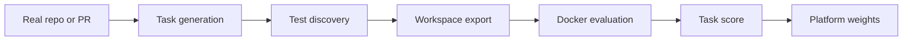

<div align="center">

# αgεηt SWE

**Synthetic software engineering benchmark generator for Platform agents**

[](https://github.com/PlatformNetwork/Agent-SWE/blob/main/LICENSE)
[](https://github.com/PlatformNetwork/platform)
[](https://www.python.org/)
[](https://huggingface.co/datasets/CortexLM/swe-forge)


</div>

Agent SWE is a Platform benchmark toolkit for building, exporting, and evaluating software engineering agent tasks. It extends SWE-Forge with a Cursor-style synthetic task pipeline: start from a real repository, delete a testable feature, then ask an agent to restore the behavior using tests as the reward signal.

The project can mine real GitHub pull requests, generate synthetic feature-deletion tasks, export benchmark workspaces, and run Docker-based evaluation against gold or model-generated patches.

## What Agent SWE Does

Agent SWE creates reproducible benchmark tasks for autonomous coding agents:

1. Select a real repository or pull request.
2. Discover install and test commands.
3. Generate or select fail-to-pass and pass-to-pass tests.
4. Export a task workspace with hidden solution artifacts.
5. Evaluate a gold patch or model patch in an isolated environment.
6. Produce task scores that can be consumed by Platform challenge validators.

## Key Features

- Real PR mining from GH Archive and GitHub metadata.
- Synthetic Cursor-style feature deletion tasks.
- Docker verification for fail-to-pass and pass-to-pass tests.
- Workspace export with `workspace.yaml`, `patch.diff`, tests, and optional `deletion_patch.diff`.
- JSONL and Parquet exports for benchmark datasets.
- Simple CLI commands for mining, synthetic generation, and evaluation.

## Evaluation Flow



For synthetic tasks, Agent SWE applies `deletion_patch.diff` first, verifies that reward tests fail, applies the candidate or oracle patch, and then verifies that reward and regression tests pass.

## Installation

```bash
git clone https://github.com/PlatformNetwork/Agent-SWE.git
cd Agent-SWE
pip install -e ".[dev]"
```

## Environment

```bash
export GITHUB_TOKEN="ghp_..."
export OPENROUTER_API_KEY="************"
```

`GITHUB_TOKEN` is used for GitHub enrichment. `OPENROUTER_API_KEY` is used for LLM-backed classification and test generation.

## Commands

### Mine Real PR Tasks

```bash
swe-forge mine mine \
  --target 10 \
  --output ./tasks.jsonl \
  --output-folder ./tasks \
  --parallel 8
```

### Verify One Pull Request

```bash
swe-forge mine complete \
  --repo owner/repo \
  --pr 12345 \
  --output ./tasks.jsonl \
  --model openai/gpt-5.4
```

### Generate a Synthetic Feature-Deletion Task

```bash
git clone https://github.com/owner/repo.git ./target-repo

swe-forge synthetic generate \
  --repo-path ./target-repo \
  --repo owner/repo \
  --source-file src/package/module.py \
  --symbol target_function \
  --fail-to-pass "pytest tests/test_target.py -v" \
  --pass-to-pass "pytest tests/ -v" \
  --install-command "pip install -e ." \
  --output-folder ./synthetic_tasks \
  --output-jsonl ./synthetic_tasks.jsonl \
  --overwrite
```

### Evaluate Gold Patches

```bash
python3 scripts/run_evaluation.py \
  --predictions_path gold \
  --instance_ids owner-repo-1234 \
  --max_workers 4
```

### Evaluate Model Predictions

```bash
python3 scripts/run_evaluation.py \
  --predictions_path predictions.jsonl \
  --max_workers 4
```

`predictions.jsonl` must contain one prediction per line:

```json
{"instance_id": "owner-repo-1234", "model_patch": "diff --git a/..."}
```

## Workspace Format

When `--output-folder` is used, tasks are exported as directories:

```text
tasks/
└── owner-repo-1234/
    ├── workspace.yaml
    ├── patch.diff
    ├── deletion_patch.diff
    ├── test_patch.diff
    ├── tests/
    ├── run_tests.sh
    └── evaluate.sh
```

`patch.diff` is the oracle solution and must be hidden from agents. `deletion_patch.diff` exists only for synthetic feature-deletion tasks and is applied before evaluation.

Example `workspace.yaml`:

```yaml
task_id: owner-repo-1234
repo:
  url: https://github.com/owner/repo.git
  base_commit: abc123def456
  merge_commit: abc123def456
language: python
prompt: Restore the deleted behavior for `target_function`.
install:
  commands:
    - pip install -e .
tests:
  fail_to_pass:
    - pytest tests/test_target.py -v
  pass_to_pass:
    - pytest tests/ -v
synthetic:
  source_type: synthetic_feature_deletion
  deletion_patch_file: deletion_patch.diff
  strategy: feature_deletion
```

## Synthetic Task Method

The synthetic pipeline follows the public Cursor Composer 2.5-style feature-deletion method:

1. Start from a real repository with tests.
2. Replace a target Python function or method body with a synthetic failure.
3. Store the mutation as `deletion_patch.diff`.
4. Store the inverse patch as `patch.diff`.
5. Use supplied tests as the reward contract.
6. Export the task for isolated evaluation.

This makes the benchmark grounded in real code while preserving an objective fail-to-pass signal.

## Development

```bash
ruff format src/ tests/
ruff check src/ tests/
mypy src/
pytest tests/ -v
```

## Repository Layout

```text
Agent-SWE/
├── assets/
├── datasets/
├── scripts/
├── src/swe_forge/
│   ├── cli/
│   ├── docker_test/
│   ├── export/
│   ├── swe/
│   └── synthetic/
└── tests/
```

## Platform Integration

Agent SWE is designed to feed Platform challenge validators with deterministic repository-repair tasks. Validators can use exported workspaces or JSONL predictions to run isolated evaluations and convert task completion rates into raw challenge scores.

## License

MIT
